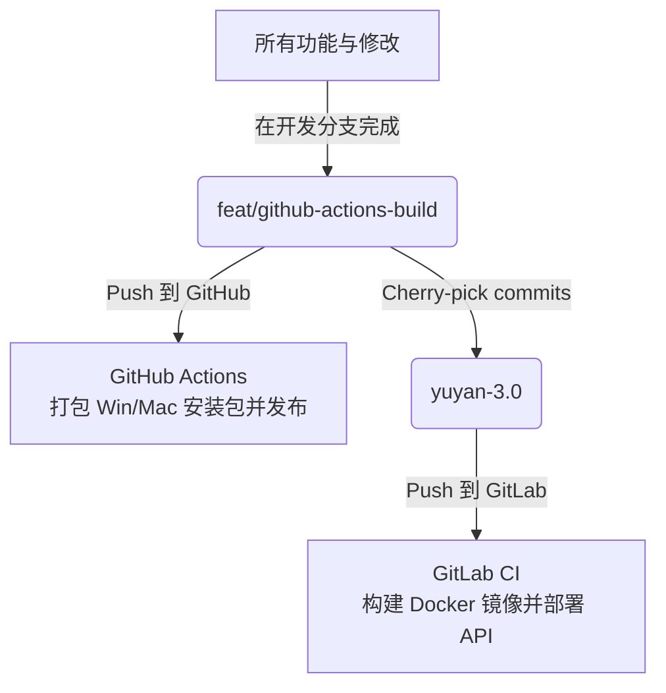

# 雨燕平台桌面端开发与部署规范

本项目采用 **双分支隔离** 的开发与部署模式，分别负责 **客户端打包** 与 **内网接口服务部署**。在后续开发中，AI 助手必须严格遵循此规范。

---

## 1. 分支角色与职责分工



### 💻 `feat/github-actions-build` 分支 (GitHub 托管)
* **核心职责**：**客户端编译与打包发布**。
* **目标远端**：`github` (git@github.com:ycwang-dev/yuyan.git)
* **CI/CD**：运行 GitHub Actions (`.github/workflows/build-tauri.yml`)，用于编译并打包 Windows 安装包 (`.exe`) 和 macOS 安装包 (`.dmg`)，并发布为 GitHub Release。
* **开发策略**：所有新功能、Bug 修复和重构都在此分支编写，确保能顺利在 GitHub 打包成功。

### 🌐 `yuyan-3.0` 分支 (内网 GitLab 托管)
* **核心职责**：**内网接口服务 (API) 的 Docker 容器部署**。
* **目标远端**：`origin` (内网 GitLab 仓库)
* **CI/CD**：运行 GitLab CI (`.gitlab-ci.yml`)，**仅执行** Docker 镜像编译与发布，以及内网部署接口服务。
* **关键限制**：**.gitlab-ci.yml 中已完全移除了 build-client 编译步骤**，禁止在此分支的 GitLab CI 中添加打包相关的任务，以防因缺少 runner 导致流水线被阻塞。

### 🔄 开发及同步流程 (Cherry-Pick 工作流)
1. 在 `feat/github-actions-build` 分支开发完新功能。
2. 提交并 Push 到 GitHub 验证打包与发布。
3. 切换至 `yuyan-3.0` 分支，通过 `git cherry-pick <commit-hash>` 将对应的修改应用过来。
4. 将 `yuyan-3.0` 分支 Push 到内网 GitLab，自动完成接口更新部署。

---

## 2. 自动更新与代理缓存架构规范

为了突破内网网络隔离并加速安装包下载，更新系统采用了 **服务端免密代理与预缓存机制**：

```
Tauri 客户端 ──(每15分钟轮询)──> 内网部署服务器 ──(使用 GITHUB_TOKEN)──> GitHub API
                                    │
                         (检测到新版自动预下载)
                                    ▼
                         本地缓存 (app-update-cache)
```

### 1) 鉴权 Token 管理
* **禁止**在前端代码、Tauri 配置文件或 Git 仓库中硬编码任何 GitHub Token。
* Token 由内网服务器环境变量 `GITHUB_TOKEN` 统一管理。
* GitLab CI 部署脚本 (`.gitlab-ci.yml`) 中必须通过 `docker run -e GITHUB_TOKEN` 保持向容器内透传。

### 2) 服务端预缓存与下载机制 (`deploy-controller.mjs`)
* **静默预下载**：检测到新版本时，服务端自动调用 `preloadAndCacheAsset` 在后台静默预下载 GitHub Release 资源，存入 `app-update-cache` 缓存目录，不阻塞客户端检测请求。
* **缓存优先下载**：客户端发起 `/deploy-api/app-update/download-asset` 下载请求时：
  * **优先**从本地缓存目录读取并直接返回，解决内网机器访问外网慢或 404 问题。
  * **回退**：缓存未命中时，实时代理中转下载，并同步写入本地缓存文件备用。
* **调试与脱敏**：在检查更新鉴权失败 (401/404) 时，返回脱敏后的 Token 长度及首尾字符信息，便于运维人员排查容器内环境变量配置是否正确。
